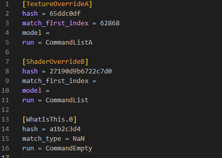
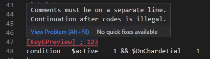
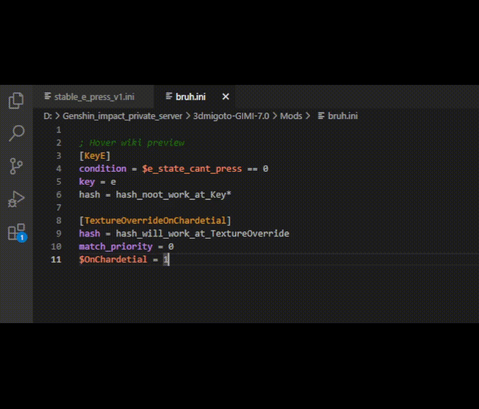
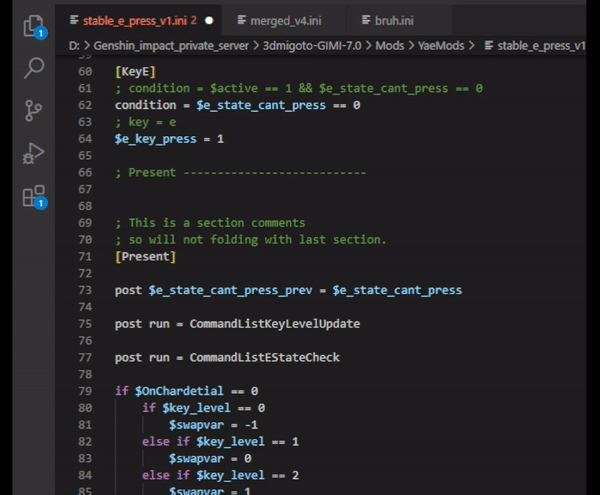
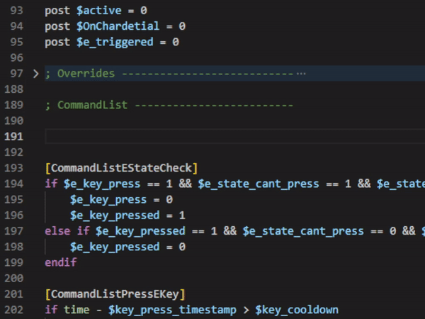
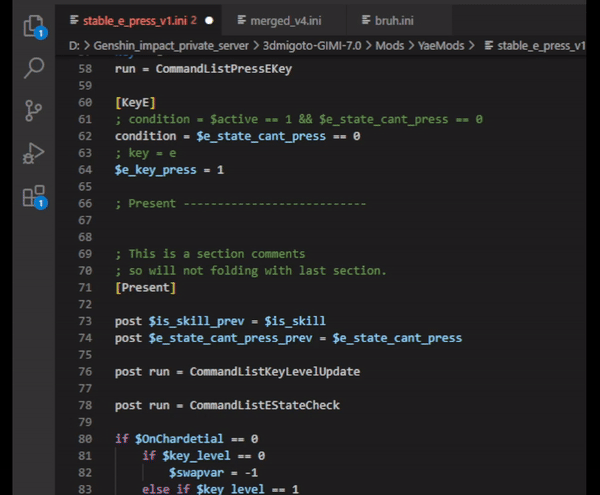
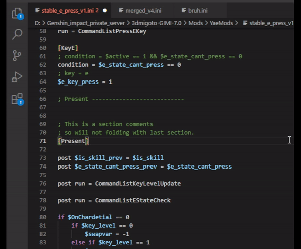
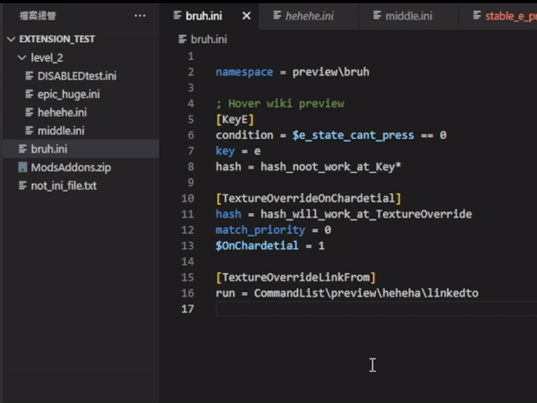
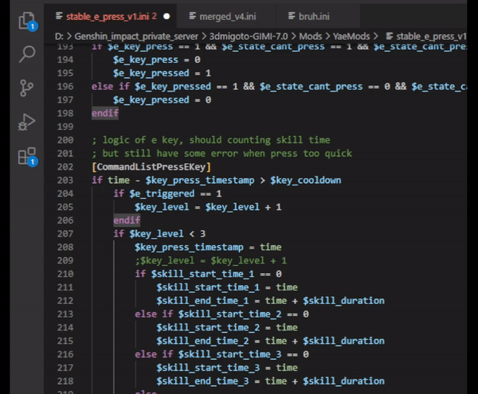
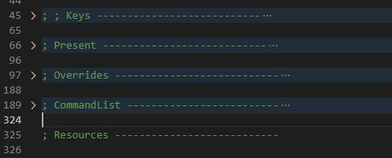

## For modder and normal user

Just keep reading.

## For developer

Please read other README at deeper folders.

---

## What is GIMI ini extension 

A famous anime game mod ini config file support extension

## Features

This is a simple extension so not have more features.

And it is still in development.

 - [x] Highlighting
 - [ ] Keyword range check
 - [ ] Simple keyword explanation
 - [x] Condition expression diagnostics

 - Auto completion
   - [x] In file variable
   - [x] Other file variable
   - [x] In file Section (specific case)
   - [ ] Other file Section
 - Buildin snippet
   - [x] Default section example
 - Code block floding
   - [x] Section
   - [x] If-else block
   - [ ] Comment
   - [ ] Convention comment separator
 - Hover message
   - [x] Section description
   - [ ] Variable description
 - Definition jump
   - [x] In file variable
   - [x] In file section
   - [x] Other file variable
   - [ ] Other file section

Static highlight preview.

Comment position diagnostics.

<!-- Also section call diagnostics.

 -->

Keyword explanation preview, Default disabled.

Auto completion for variable.

Simple section snippets.

Definition jump for variables and sections. If open as project (workspace), jumping between files is also supported.

Code folding for section and `if else` block.

A comment separation type, just like Markdown's horizontal line.

<!-- Of course more description on it. Leave a empty line above and below to work.

 -->

> Tip: No more image or animations from now.

## Version Requirements
 - VScode 1.91.0

## Requirements

 - Don't be rude
 - Don't make a big deal about it
 - Don't jump face with the official

## Extension Settings

Noop.

<!-- Include if your extension adds any VS Code settings through the `contributes.configuration` extension point.

For example:

This extension contributes the following settings:

* `myExtension.enable`: Enable/disable this extension.
* `myExtension.thing`: Set to `blah` to do something. -->

## Known Issues

~~This extension is a piece of sh--~~

The following types of editing can starting make features get error.

 - Any editing when range is contain section title
 - Quick copy lines (Both up and down).
 - Move line (Both up and down)

## How to fix any weird things?

It is very simple. Just restart VScode.

## Release Notes

No release version until now.

### 0.4.0

Change:
 - Internal parsing engine completely rebuild.
 Now can processed files with 30,000+ lines, and still quickly.

Added:
 - Better code diagnostics
   - key-value pair.
   - Namespace check.
   - Condition expression.
 - Better highlight colors.

Fixed:
 - When `key` keyword at Key section have `;` get wrong highlight
 - 

### 0.2.1
Added:
 - Variable auto completion
 - Variable and section definition jump
 - Diagnostic for illegal comment

### 0.1.0

Very huge changes. They have tow types.
 1. Feasibility testing in progress:
   - Keyword range checking.
   - Keyword meaning hover tips.
 2. Already working:
   - The rules of tmLanguage has been change,
     including but not limited to nesting, area checking, possible range guessing.

I need some color style suggestions, and tmLanguage token namespace regularization...

### 0.0.1

Initial builded of ...

---

### Participants

 - SinsOfSeven 
 - LeoMods 
 - !someone name has 63B long? 

<!-- ## Working with Markdown

You can author your README using Visual Studio Code. Here are some useful editor keyboard shortcuts:

* Split the editor (`Cmd+\` on macOS or `Ctrl+\` on Windows and Linux).
* Toggle preview (`Shift+Cmd+V` on macOS or `Shift+Ctrl+V` on Windows and Linux).
* Press `Ctrl+Space` (Windows, Linux, macOS) to see a list of Markdown snippets.

## For more information

* [Visual Studio Code's Markdown Support](http://code.visualstudio.com/docs/languages/markdown)
* [Markdown Syntax Reference](https://help.github.com/articles/markdown-basics/)

**Enjoy!** -->
