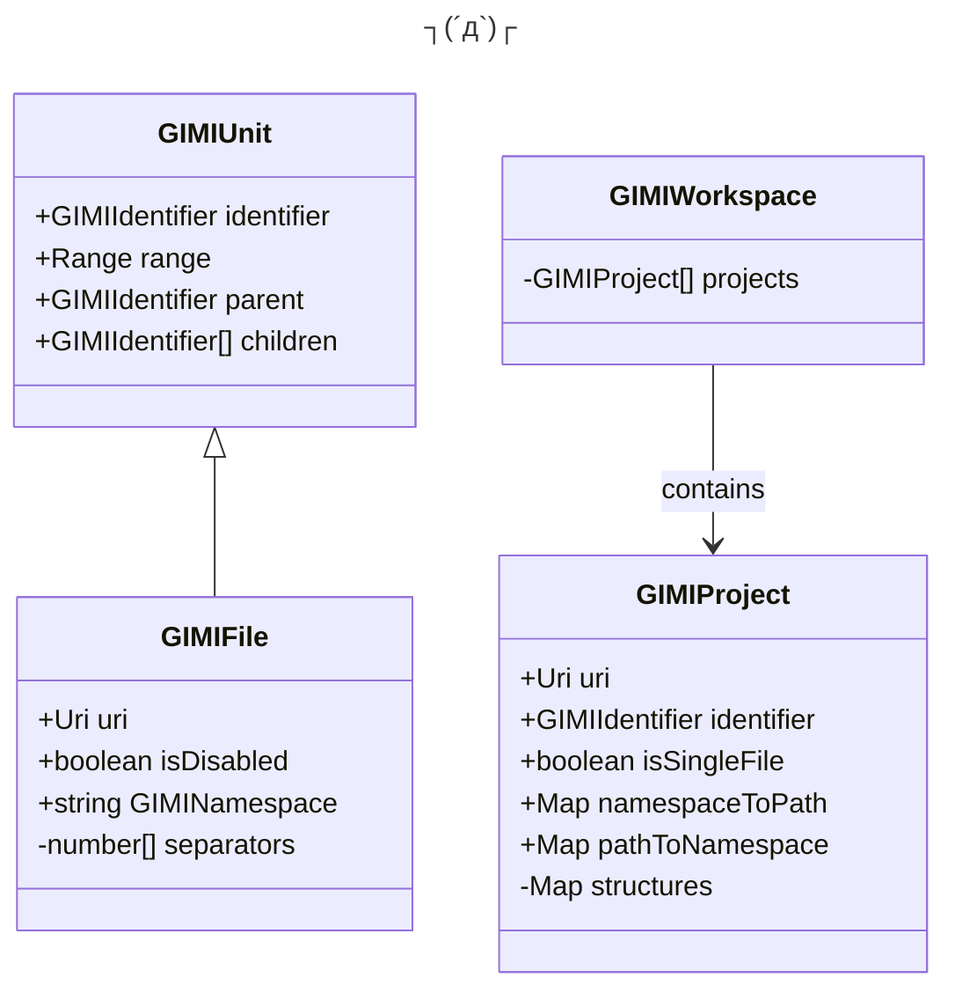
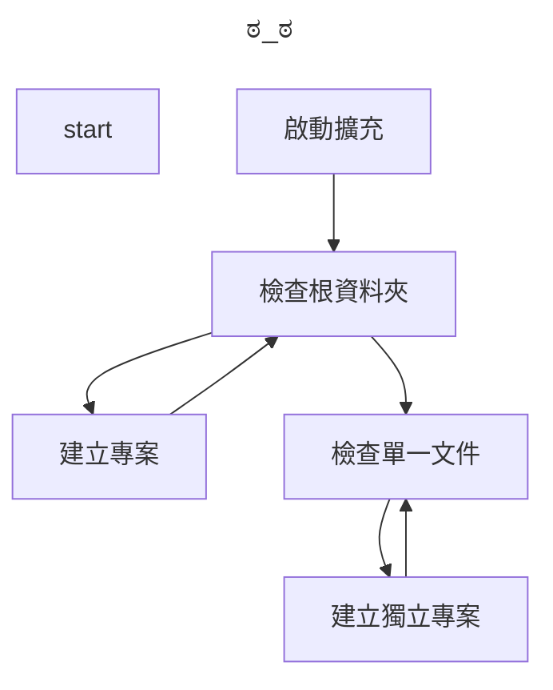

## 類關係

```mermaid
---
title: ┐(´д`)┌

---
classDiagram

    class GIMIUnit {
        +GIMIIdentifier identifier
        +Range range
        +GIMIIdentifier parent
        +GIMIIdentifier[] children
    }

    class GIMIFile {
        +Uri uri
        +boolean isDisabled
        +string GIMINamespace
        -number[] separators
    }

    GIMIUnit <|-- GIMIFile

    class GIMIWorkspace {
        -GIMIProject[] projects
    }

    class GIMIProject {
        +Uri uri
        +GIMIIdentifier identifier
        +boolean isSingleFile
        %% +GIMIIdentifier[] files
        +Map namespaceToPath
        +Map pathToNamespace
        -Map structures
    }

    GIMIWorkspace --> GIMIProject : contains

```

```mermaid
---
title: ಠ_ಠ

---
flowchart TD
    start
    啟動擴充 --> 檢查根資料夾
    檢查根資料夾 --> 建立專案
    建立專案 --> 檢查根資料夾
    檢查根資料夾 --> 檢查單一文件
    檢查單一文件 --> 建立獨立專案
    建立獨立專案 --> 檢查單一文件
```
